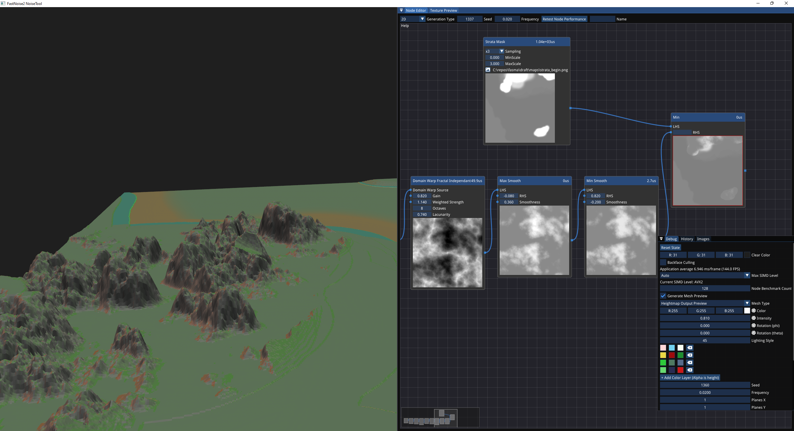

# Terra 

This is a fork to the amazing FastNoise2 library 

[Original Readme](OriginalREADME.md)

The fork is focused on the Terra, a heightmap generator, rather than the actual library.

# Exclusive Features 

- Multi-threaded generation of density values 
- Multi-threaded terrain generation
- Some new domain functions 
- Add custom images to reference in domain functions as masks
- Export in RAW format
- Export multiple planes of terrain

# Planned Features
- [x] Node editor on a different window
- [x] Random scale/rotate generator (per plane)
- [ ] Node grouping into meta groups
- [x] Add camera re-focus button
- [x] Fix typing speed bug in tool window
- [x] Fix random constant gen bug
- [ ] A way to mark nodes as pass through
- [ ] Select grid to export
- [ ] Link Mesh parameters to texture parametrs (remove duplicates)
- [ ] Grid names
- [ ] Strata bound to grid by name/index
- [ ] Generate per grid, grid id stored in Uniform

